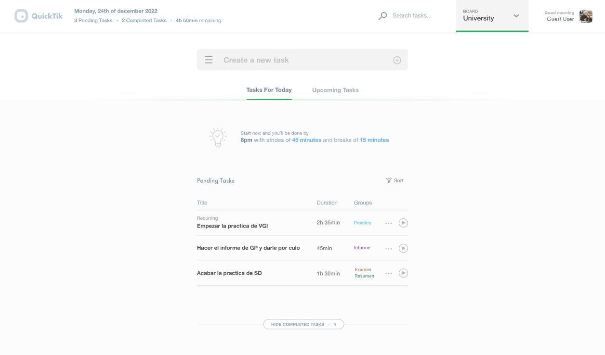
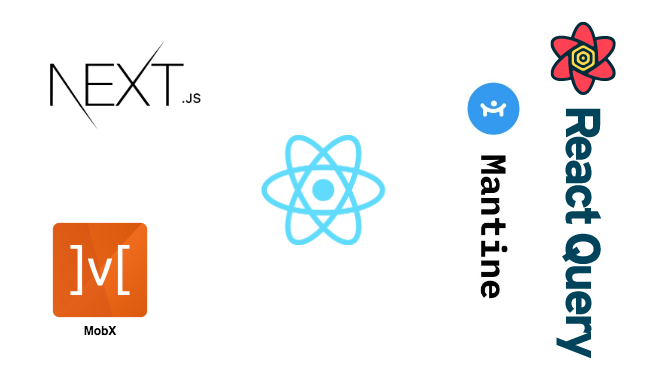

<p align="center">
  
</p>
<br />
<p align="center">
  QuickTik - A simple time bounded to-do task scheduler.
</p>
<br />
<br />

Quick schedule is a web app that allows you to create tasks with a timer attached to them. It allows you to play, pause, edit or mark the tasks as completed. Currently all data will be saved locally in your device using LocalStorage WebApi so be careful when clearing browser data.

<br />

<p align="center">
  
  Design Layout
</p>

<br />
<br />

<br />

<p align="center">
  
  Tech Stack
</p>

<br />
<br />

## Motivation

This project is just a learning exercise to improve my design and development skills using react, next.js and more libraries that I don't get a chance to use at work.

This project is a kind of an over-engineered to-do list.

<br />
<br />

## Running in local envoirnment

First, run the development server:

```bash
npm run dev
# or
yarn dev
```

Open [http://localhost:3000](http://localhost:3000) with your browser to see the result.
