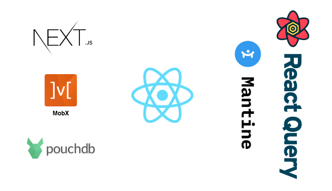

<p align="center">
   <br/>
   <br/>
   <a href="quicktik.mohsinriaz.es" target="_blank"></a>
   <br/>
   <br/>

   <h3 align="center">QuickTik</h3>
   <p align="center">
   A simple time bounded to-do task scheduler.
   </p>
   <br/>
   <p align="center" style="align: center;">
      <a href="#">
        
      </a>
      <a href="https://opensource.org/licenses/MIT">
        
      </a>
      <a href="https://opensource.org/licenses/MIT">
        
      </a>
   </p>
</p>

<br/>
<hr />

## Overview

QuickTik is a web app that allows you to create tasks with a timer attached to them and organize them in different boards. It allows you to play, pause, edit or mark the tasks as completed.

> **IMPORTANT** – Currently all your data will be store locally in your device using IndexedDB so be careful when clearing browser data.

<br />
<br />

<p align="center">
  
  <br />
  Tech Stack
</p>

<br />
<br />

## Motivation

This project is just a learning exercise to improve my design and development skills using react, next.js, lerna, yarn workspaces and other tech and libraries that I don't get the chance to use at work.

> Note: This project is a kind of an over-engineered to-do list, so please don't take it too seriously 😅

<br />
<br />

## Stuff to add in a futur version

-   Add a backend for multi-device usage of the app.
-   Add a proper pomodoro setup (?)
-   Add notifications (mail, push, etc...)
-   Collaborative boards and tasks with owner, editors and viewers.
-   Create an ultra-minimal, distraction-free board view for people with ADHD.
-   Other platforms integration (Google, Trello, etc...)

<br />
<hr />

## Getting Started

### 1. Clone the repository and install dependencies

```bash
git clone https://github.com/im-mou/quicktik.git
cd quicktik
yarn install
# or
npm install
```

<br />

### 2. Running in local envoirnment

**Setup and running the project using YARN w/ workspaces**

Run next.js dev server:

```bash
# run next.js dev server
yarn dev
```

Or run next.js production server:

```bash
# run next.js production server
yarn build
yarn start
```

<br />

**Setup and running the project using NPM w/ lerna**

```bash
# install all deps
npm run bootstrap

# run next.js dev server
npm run dev

# or:

# Production server:
npm run build
npm run start
```

Open [http://localhost:3000](http://localhost:3000) with your browser to see the result.

<br />

### 3. Run storybooks for local development (Optional)

This monorepo is composed of 3 packages:

**next-app**

-   Main next.js app
-   Package that imports all the other packages listed below.

**material-ui-components**

-   Package containing react components made w/ Material-UI
-   Contains [Storybook](https://storybook.js.org/) that run on [http://localhost:6006](https://storybook.js.org/)

**mantine-ui-components**

-   Package containing react components made w/ Mantine
-   Contains [Storybook](https://storybook.js.org/) that run on [http://localhost:6016](https://storybook.js.org/)

<br />

To run all storybooks at once, run the following command:

```bash
yarn storybook
# or
npm run storybook
```

To run a specific storybook, navegate to the package and run the command above.

<br />

### 4. Deployment: next.js static app (Optional)

```bash
# Compile next.js as a static project for production.
# With this command there is no need to build, it does it automatically.

yarn export
# or
npm run export
```

<br />
<br />

## Wana contribute?

Go ahead, let's help each other out and improve over skills and become better programmers or.. whatever.

Have fun!

<br />

## License

MIT
